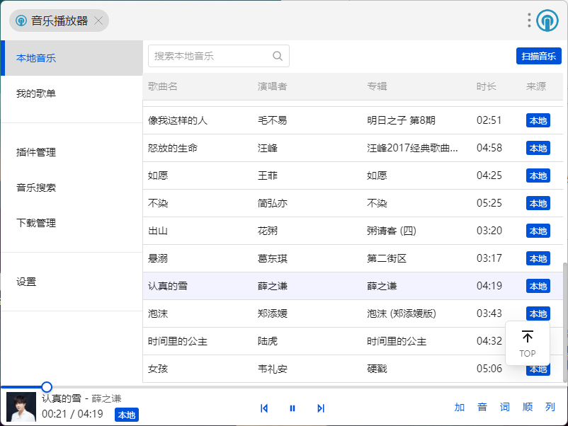
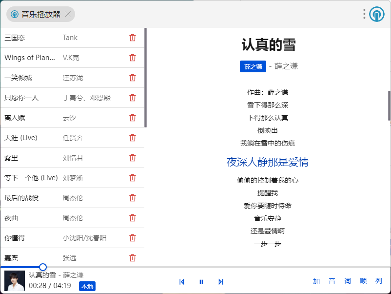
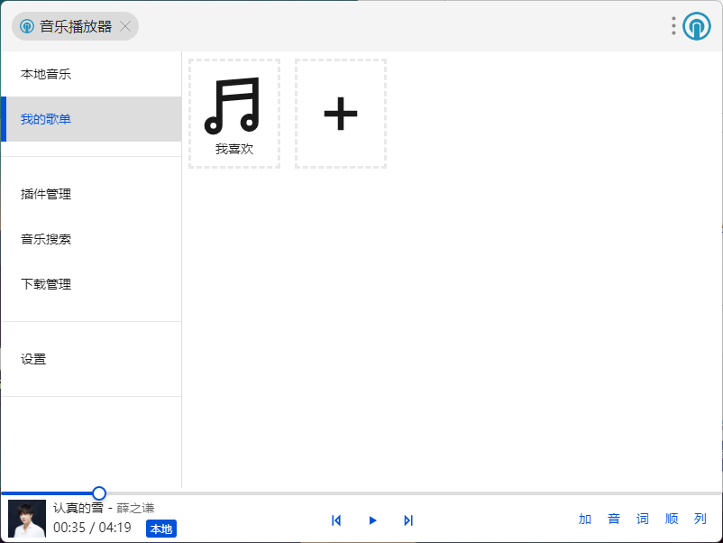
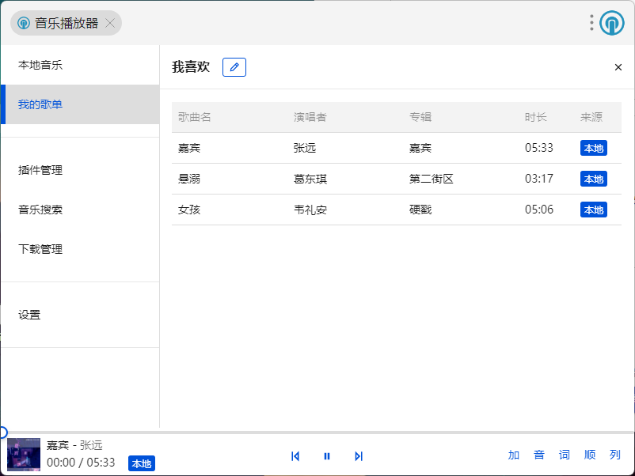
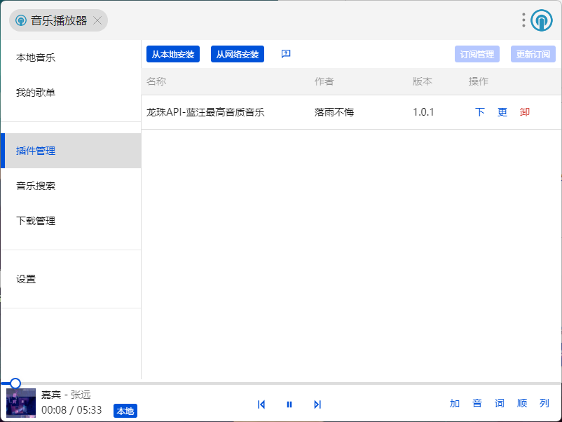
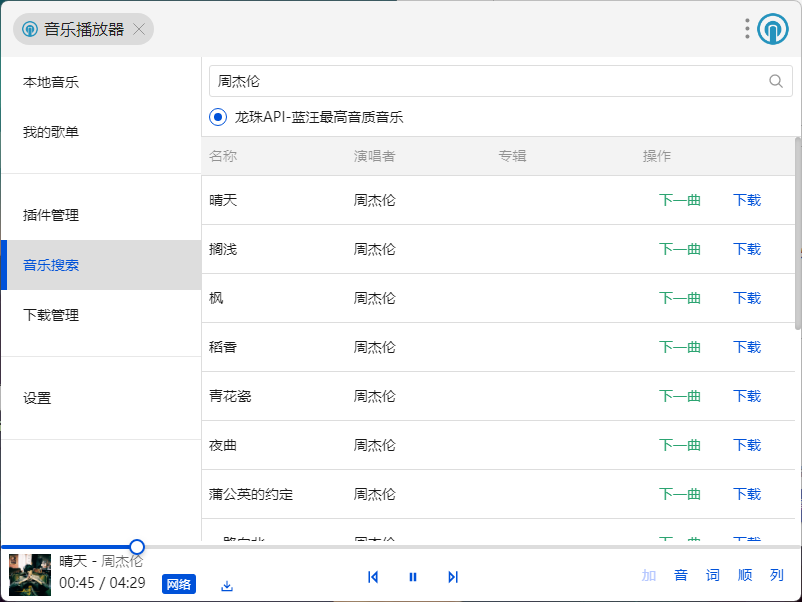

# uTools插件 - 音乐播放器

一个本地音乐优先的uTools插件，插件中的音乐源参考自[MusicFree](https://musicfree.catcat.work)。

## 特性

- 本地优先
- 支持封面、歌词
- 支持拓展音乐源，插件内下载音乐
- 轻量、易用

## 预览图

- 本地音乐
  
- 播放器
  
- 歌单
  
- 歌单详情
  
- 插件
  
- 音乐搜索
  